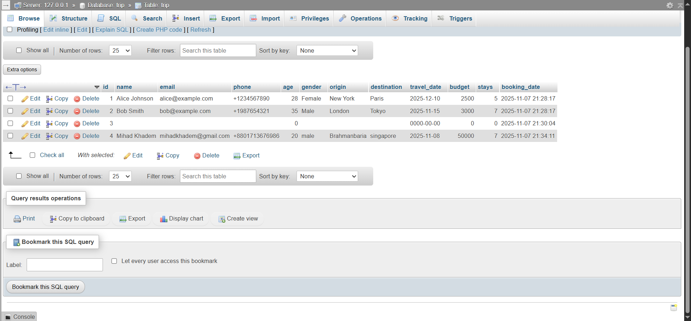

# php_travel_planner

# 🧭 PHP Travel Planner

A simple PHP + MySQL project that helps users plan their trips by submitting details like name, destination, travel date, and budget through an HTML form.  
All submitted data is stored in a MySQL database for easy management and review.

---

## 🚀 What I Built

- A **responsive HTML form** to collect user travel data.
- A **PHP backend** that connects to a MySQL database.
- Used **SQL INSERT queries** to store user data dynamically.
- Added **form validation** and **JavaScript alerts** for better UX.

---

## 🧠 What I Learned

- How to **connect PHP with MySQL** using `mysqli_connect`.
- How to **handle form submissions securely** using POST.
- How to **create tables** and define primary keys in phpMyAdmin.
- How to **Insert data** into MySQL using PHP.
- How to **debug common MySQL errors**, like missing databases or incorrect table definitions.

---

## 📸 Screenshots

| Homepage | Database Entry |

 |

---

## ⚙️ Tech Stack

- **Frontend:** HTML, CSS
- **Backend:** PHP
- **Database:** MySQL
- **Tools:** XAMPP, phpMyAdmin, Git, VScode

---

## 💡 Future Improvements

- Add a “Trip Summary” page after submission.
- Include user authentication (login/register).
- Build an admin panel to view all planned trips.

---

### 🧑‍💻 Author

**Mihad Khadem**

> "Every small project builds the foundation for bigger creations."
